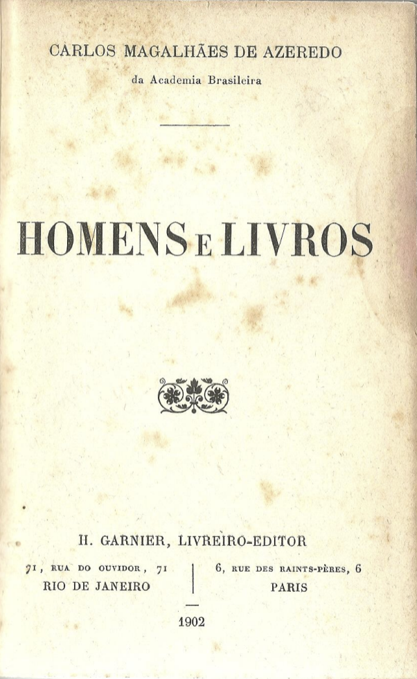

<h2 class="page-tile">
  Livros
</h2>

  <dl>
    <dt class="break-line">
      Leopardi - O Pensamento Em Poesia
    </dt>
    <dd class="break-line">Antonio Prete</dd>
     
      
  </dl>

  <dl>
    <dt class="break-line">
      Giacomo Leopardi
    </dt>
    <dd class="break-line">Carlos M. Azeredo. 1902</dd>
     
      
  </dl>

